# Godot Coordinate System Transformations

A couple of examples on how to transform coordinates from one system into another. From local, lower nodes up the scene tree towards higher nodes, including SubViewports and the screen.

https://github.com/user-attachments/assets/9bf60690-862d-4cb0-b290-c5b7b0c7943f

([view on Youtube](https://www.youtube.com/watch?v=84A9ChaZzd8) if the video doesn't play)

## "What are we doing? Is this difficult?"

...you might ask. It isn't, if you know what you are doing.™️ But there are some edge cases that deserve attention and aren't as straightforward as one would like, so I wrote this down for other people who run into these issues.

What we want to find out is how to transform coordinates from the local coordinate system of a Control to Canvas or screen coordinates. You usually do this by multiplying your local coordinates with a transform from "higher up the tree". But once SubViewports, scaling, rotation, stretching and flipping come into play, things can get a bit more complicated. Also there's [a bug](https://github.com/godotengine/godot/issues/115265).

## "What do?" 🦜

Move your mouse around the screen. Under the mouse cursor you see the local coordinates of the Control(s) that got a mouse motion GUI event:

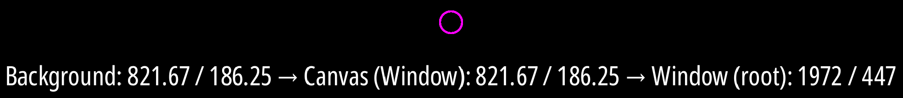

- The mouse moved over the "Background" node, at 821.67 / 186.25 (in local Control coordinates).
- That's the same position on the CanvasLayer that includes the "Background" node.
- Transformed into "real" Screen pixel coordinates this results in 1972 / 447.

Also you can draw on a Blackboard (the greenish rectangles) and they will show the local coordinates of the mouse cursor when they receive mouse motion events in `_gui_input()`:

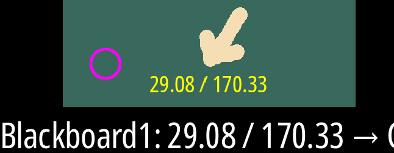

Hover over an info label to get a tooltip for better readability:

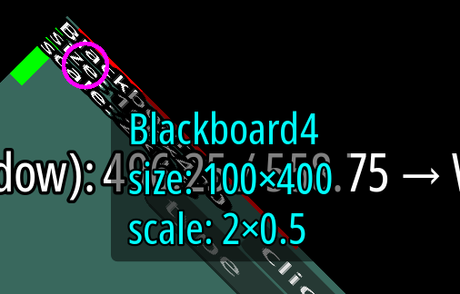

### Hotkeys

- `F11`: Toggle fullscreen.
- `Escape`: Quit

## GUIMouseListener and "mouse_moved" Signals

Most normal Controls who report mouse movement events extend from `GUIMouseListener` ([gui_mouse_listener.gd](CoordinateSystems/scenes/gui_mouse_listener.gd)). Once they receive an `InputEventMouseMotion` in `_gui_input()` they send a "mouse_moved" signal to report the mouse movement to the `MouseOverlay`:

```gdscript
func _gui_input(event: InputEvent) -> void:
    var mouse_motion_event: InputEventMouseMotion = event as InputEventMouseMotion
    if mouse_motion_event:
        Events.mouse_moved.emit(self, mouse_motion_event.position)
```

## MouseOverlay

The `MouseOverlay` ([mouse_overlay.gd](CoordinateSystems/scenes/mouse_overlay.gd)) listens for "mouse_moved" signals. Once it receives a signal from a Control it transforms the local mouse position into coordinates of all the Viewports the Control is embedded in.

## Transformations
### Simple Controls

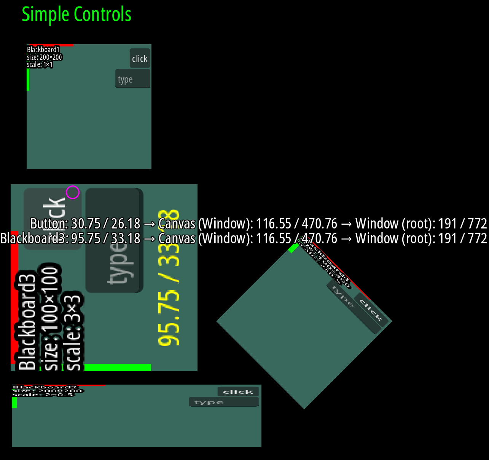

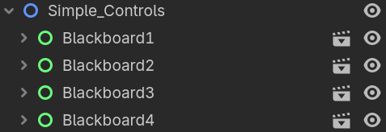

Just some Blackboards (which are basically just Controls). Some are scaled or rotated, but since scale and rotation are part of the transform this is completely straightforward (the actual code is in [mouse_overlay.gd](CoordinateSystems/scenes/mouse_overlay.gd)):

```gdscript
var viewport := control.get_viewport()
var coords_on_canvas := control.get_global_transform_with_canvas() * local_control_coords
var window_coords := viewport.get_screen_transform() * coords_on_canvas
```

1. Transform the local Control coordinates into Canvas coordinates.
2. Transform the Canvas coordinates into screen coordinates. These are the real pixels on the screen (or at least in the Window).

### SubViewports in SubViewportContainers

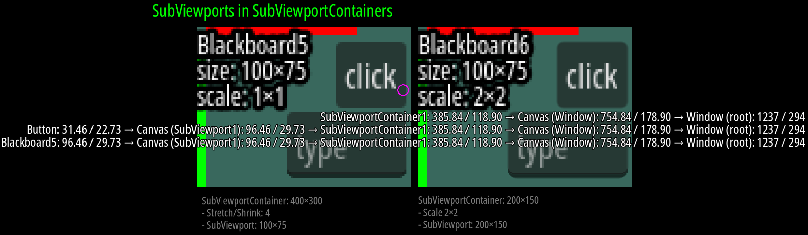

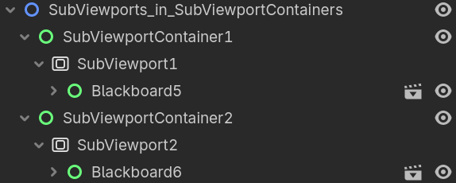

The first two are fairly simple: SubViewports inside SubViewportContainers and each SubViewport contains a Blackboard control. The final size of each SubViewportContainer is 400×300, but they are set up differently.

#### First SubViewportContainer

- Size: 400×300
- Stretch/Shrink: 4
- SubViewport: 100×75
	- Blackboard: 100×75

1. The Blackboard control is rendered with a size of 100×75 inside the 100×75 Viewport.
2. The Viewport is stretched by 4 to a size of 400×300.

#### Second SubViewportContainer

- Size: 200×150
- Scale 2×2
- SubViewport: 200×150
	- Blackboard: 100×75
        - Scale 2×2

1. The Blackboard control is rendered with size 100×75, but scaled by 2 to 200×150.
2. The Viewport is rendered at 200×150, but also scaled by 2 to 400×300.

#### Third SubViewportContainer

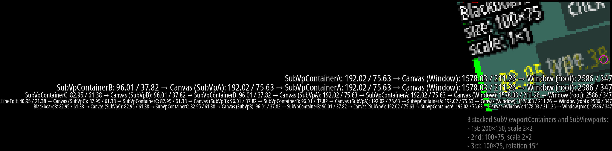

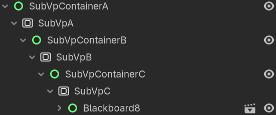

These are three SubViewportContainers and three SubViewports embedded inside each other.

- SubViewportContainer A: 200×150, scale 2×2
    - SubViewport A: 200×150
        - SubViewportContainer B: 100×75, scale 2×2
            - SubViewport B: 100×75
                - SubViewportContainer C: 100×75, rotation 15°
                    - SubViewport C: 100×75
                        - Blackboard: 100×75

#### Transformations

The transformations for all of these work somewhat like this (the actual code is in [mouse_overlay.gd](CoordinateSystems/scenes/mouse_overlay.gd)):

```gdscript
func calculate_transformations(control: Control, local_control_coords: Vector2):
    var sub_viewport: SubViewport = control.get_viewport() as SubViewport
    var sub_viewport_container: SubViewportContainer = sub_viewport.get_parent() as SubViewportContainer

    var coords_on_sub_viewport_canvas := control.get_global_transform_with_canvas() * local_control_coords
    var local_sub_viewport_container_coords := coords_on_sub_viewport_canvas

    if sub_viewport_container.stretch && sub_viewport_container.stretch_shrink > 1:
        local_sub_viewport_container_coords *= sub_viewport_container.stretch_shrink

    # recurse
    calculate_transformations(sub_viewport_container, local_sub_viewport_container_coords)
```

1. Get the SubViewport of the Control.
2. Get the SubViewportContainer that contains the SubViewport.
3. Transform the local Control coordinates into SubViewport coordinates.
4. Transform the SubViewport coordinates into local SubViewportContainer coordinates.
5. Adjust the local SubViewportContainer coordinates by stretch/shrink if necessary.
6. Recursively do this all again, but now for the SubViewportContainer, going up the tree.

### A single 200×200 SubViewport rendered in multiple TextureRects

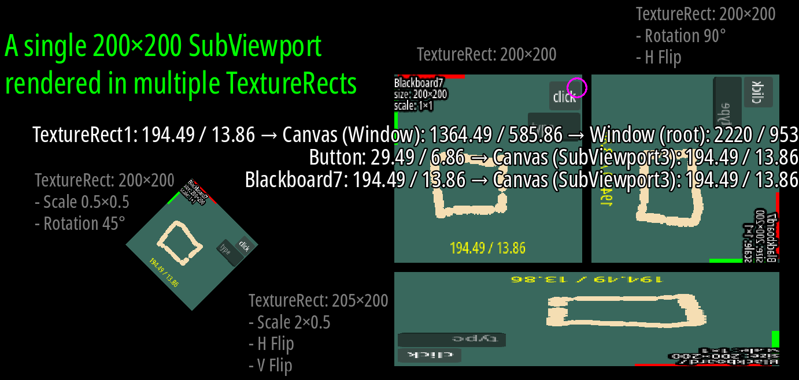

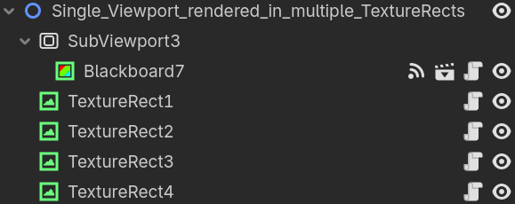

These are four different TextureRect controls that render the content of the same SubViewport as ViewportTextures. Some TextureRects are scaled, rotated or flipped.

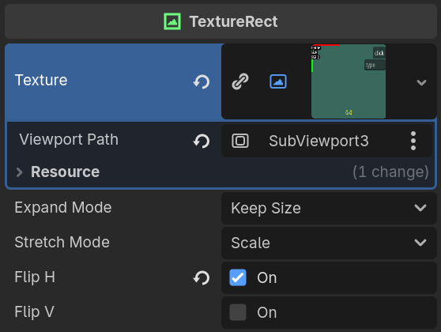

Unlike a SubViewportContainer, which does all the work for us under the hood, we need to forward all the events to the SubViewport manually. All our TextureRects have the [gui_input_forwarder.gd](CoordinateSystems/scenes/gui_input_forwarder.gd) script attached to them, which takes care of this. The important part here are the InputEvents, which we need to forward to the SubViewport.

In case of mouse events we have to manually transform the coordinates to Viewport coordinates first and also take horizontal and vertical flipping into consideration.

```gdscript
func _gui_input(event: InputEvent) -> void:
    if is_propagated_in_gui_input(event):
        if event is InputEventMouse:
            var ev: InputEventMouse = event.duplicate()

            if ev is InputEventMouseMotion:
                Events.mouse_moved.emit(self, ev.position)

            ev.position = to_viewport_coords(ev.position)
            sub_viewport.push_input(ev)
        else:
            sub_viewport.push_input(event)


func to_viewport_coords(pos: Vector2) -> Vector2:
    var normalized_pos := pos / size
    if flip_h:
        normalized_pos.x = 1.0 - normalized_pos.x
    if flip_v:
        normalized_pos.y = 1.0 - normalized_pos.y
    return normalized_pos * Vector2(sub_viewport.size)
```

> Note: Due to (what I would personally call) [a bug](https://github.com/godotengine/godot/issues/115265) we can only forward InputEventMouseMotion events to the SubViewport if we sent it a `NOTIFICATION_VP_MOUSE_ENTER` first.

```gdscript
func _notification(what: int) -> void:
    # Due to a bug we need to manually send NOTIFICATION_VP_MOUSE_ENTER to the SubViewport,
    # because otherwise we wouldn't be able to push InputEventMouseMotion events.
    # https://github.com/godotengine/godot/issues/115265
    match what:
        NOTIFICATION_MOUSE_ENTER: sub_viewport.notification(NOTIFICATION_VP_MOUSE_ENTER)
        NOTIFICATION_MOUSE_EXIT: sub_viewport.notification(NOTIFICATION_VP_MOUSE_EXIT)
```

Once we have taken care of all of this and pushed the input events to the SubViewport, they will eventually reach the Controls inside it. Transforming the local Control coordinates back to SubViewport coordinates is straightforward (see [mouse_overlay.gd](CoordinateSystems/scenes/mouse_overlay.gd) for all the details):

```gdscript
var coords_on_sub_viewport_canvas := control.get_global_transform_with_canvas() * local_control_coords
```


Note how, once we know the SubViewport coordinates, we cannot go further up the tree from the SubViewport to a TextureRect, like we did previously with SubViewportContainers, because the SubViewport has no idea that its contents are rendered inside a TextureRect (or shown at all) and also it isn't a child of any of the TextureRects.

## "Readability sucks!"

Yeah. 🙁

## "Why?"

I was doing some 2D pixel style tests and playing around with 2D cameras and ran into issues converting coordinates back and forth between the cameras, UI, the game world and sub viewports. Thus a step back and more thorough investigation was called for.

Also I ran into some issues that took me a while to figure out and there wasn't much information out there, so I wanted to provide a resource to help people, which is why this whole thing got a little more elaborate than just a little personal test project.

## Further Reading

[2D coordinate systems and 2D transforms](https://docs.godotengine.org/en/stable/engine_details/architecture/2d_coordinate_systems.html) in the Godot Engine documentation.

## Credits

- [Noto Sans](https://fonts.google.com/noto/specimen/Noto+Sans) font, by Google, licensed under the [SIL Open Font License Version 1.1](https://openfontlicense.org/open-font-license-official-text/).
